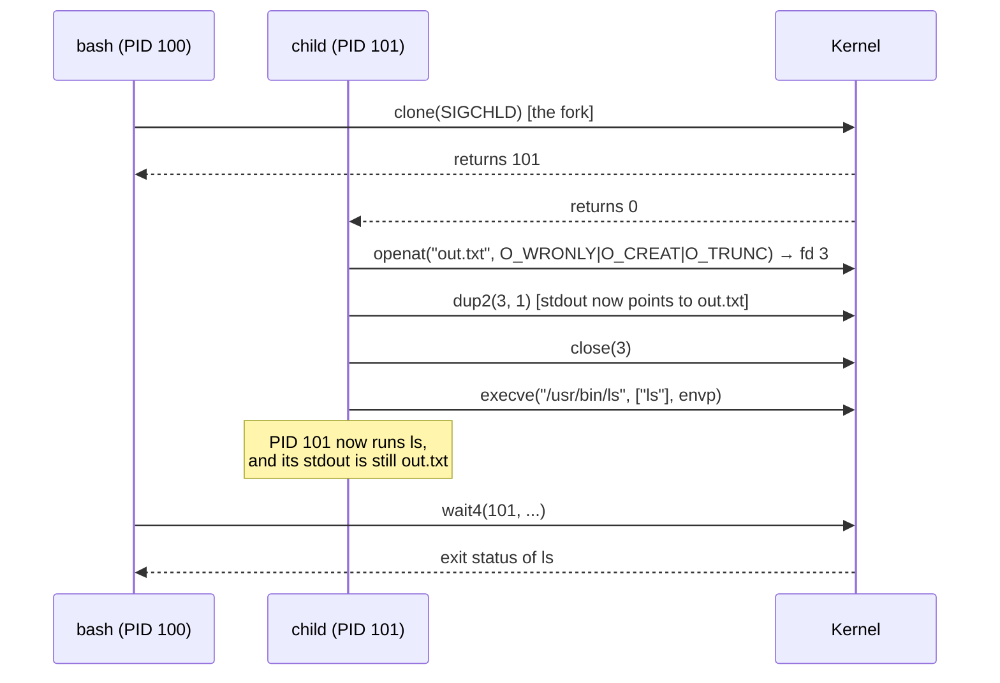

# 3. fork, execve, and clone

This is the most important section of Chapter 01. If you understand it, the
system calls that create containers will look like small variations of
something familiar.

## The problem: start a different program

A shell must start `ls`. A JVM `ProcessBuilder` must start `git`. `containerd`
must start your application. In all cases, a running process wants a *new
process* that runs a *different program*.

Many operating systems provide one call that does both, such as Windows'
`CreateProcess`. Unix deliberately split the job into two independent
operations:

| Operation | System call | What it does |
|---|---|---|
| Create a new process | `fork()` (implemented with `clone`) | Duplicate the calling process. Same program, new PID. |
| Run a different program | `execve()` | Replace the program inside the *current* process. Same PID, new program. |

Why split it? Because the gap between the two calls is extremely useful.
After `fork()`, the child is still running the parent's code, so it can call
**ordinary system calls to modify itself** before becoming the new program.
The new program then starts with those modifications already in place.

A shell running `ls > out.txt` uses this gap:



`ls` contains no code for redirection. It simply writes to file descriptor 1.
The shell configured the process in the gap, and `execve()` preserved that
configuration.

> **This is the whole idea of a container runtime.** Replace "redirect stdout"
> with "enter new namespaces, change the root filesystem, join a cgroup, drop
> capabilities, install a seccomp filter". The runtime configures a process in
> the gap, then `execve()`s your application, which inherits the configuration
> without knowing it exists.

## fork()

```c
#include <unistd.h>
pid_t fork(void);
```

`fork()` creates a new process (the **child**) that is a near-exact copy of
the calling process (the **parent**). It is called once and **returns twice**:

- in the parent, it returns the child's PID;
- in the child, it returns `0`;
- on failure, it returns `-1` in the parent, and no child exists.

```c
pid_t pid = fork();
if (pid == 0) {
    // child: running the same program, from this exact point
} else if (pid > 0) {
    // parent: pid is the child's PID
} else {
    // error
}
```

### Copy-on-write

"Copy the whole process" sounds expensive for a 4 GB JVM. It is not, because
of **copy-on-write (COW)**. The kernel does not copy memory pages at `fork()`.
Parent and child initially share the same physical pages, marked read-only.
When either process writes to a page, the CPU raises a page fault, and only
then does the kernel copy that single page. Most children quickly call
`execve()`, which discards the address space, so most pages are never copied.

### What the child gets

| Property | In the child after `fork()` |
|---|---|
| PID | New |
| PPID | The parent's PID |
| Memory | Copy (copy-on-write) |
| File descriptors | Copy of the table, pointing to the **same** open files ([section 5](05-file-descriptors.md)) |
| Current directory and root directory | Copy |
| Credentials (UID, GID, capabilities) | Copy |
| Signal handlers and signal mask | Copy |
| Pending signals | Cleared |
| Namespaces | Same as parent |
| cgroup membership | Same as parent |
| Threads | **Only the thread that called `fork()`** exists in the child |

The last row matters for multithreaded runtimes. If a Go program or a JVM
calls `fork()`, the child contains only one thread, while memory may contain
locks held by threads that no longer exist. This is why such runtimes perform
very little work between `fork` and `exec`, and why runc performs some of its
most delicate setup in a small C program before the Go runtime starts
(Chapter 11).

## execve()

```c
#include <unistd.h>
int execve(const char *pathname, char *const argv[], char *const envp[]);
```

`execve()` loads a new program into the **current** process:

- `pathname` — the executable file to run;
- `argv` — the argument list; by convention `argv[0]` is the program name;
- `envp` — the environment, an array of `"KEY=value"` strings.

On success, `execve()` **does not return**: the code that called it no longer
exists. On failure (file not found, not executable, permission denied), it
returns `-1`, and the original program continues.

### How the kernel runs the new program

1. Open `pathname` and check execute permission.
2. Read the first bytes to identify the format:
   - `\x7fELF` — a native ELF executable. If it is dynamically linked, the
     kernel also maps the **dynamic loader** named inside the file
     (for example `/lib64/ld-linux-x86-64.so.2`), which later loads libc.
   - `#!` — a script. The kernel runs the interpreter named on that line (for
     example `/bin/sh`) and passes the script path as an argument.
3. Discard the old address space and create a new one containing the program,
   the loader, a new stack, and the vDSO.
4. Copy `argv` and `envp` onto the new stack.
5. Reset properties that would be dangerous or meaningless to keep (see table).
6. Start execution at the entry point (the loader's, or the program's).

### What survives execve()

This table is the most important table in the chapter. Container setup works
because of the "Preserved" column.

| Property | After `execve()` |
|---|---|
| PID and PPID | **Preserved** |
| Memory, code, heap, stack | Replaced |
| Other threads | Destroyed; only the calling thread continues |
| File descriptors | **Preserved**, except those marked close-on-exec |
| Current directory and root directory | **Preserved** |
| UIDs and GIDs | **Preserved** (unless the file is set-user-ID / set-group-ID, [section 7](07-credentials.md)) |
| Capabilities | Recalculated by specific rules (Chapter 05) |
| Namespaces | **Preserved** |
| cgroup membership | **Preserved** |
| Resource limits (`setrlimit`) | **Preserved** |
| Seccomp filters and `no_new_privs` | **Preserved** (Chapter 06) |
| Signal mask and pending signals | **Preserved** |
| Signals with a handler function | Reset to default action (the handler code is gone) |
| Signals set to ignore | **Preserved** as ignored |
| Environment | Whatever the caller passes in `envp` |

### Arguments and environment

Notice that the environment is **not** a global kernel setting. It is just an
array that the caller passes to `execve()` and the kernel copies onto the new
stack. "Inheriting environment variables" only happens because libc's
`execv()`/`execvp()` wrappers pass the current process's `environ` array
automatically. A process that calls `execve()` with an empty `envp` starts a
program with no environment at all. A container runtime uses exactly this to
give your application the environment variables from its configuration
instead of the runtime's own.

The kernel records where `argv` and `envp` were placed in memory and exposes
the original bytes as `/proc/<pid>/cmdline` and `/proc/<pid>/environ`.

## clone(): the general mechanism

On Linux, `fork()` is not actually a separate kernel mechanism. The kernel has
one general process-creation routine, and several system calls are different
front ends to it:

```text
fork()   ─┐
vfork()  ─┤
clone()  ─┼──► kernel_clone()  ──►  copy_process()
clone3() ─┘           (kernel/fork.c)
```

`copy_process()` builds the new `task_struct`. For each major resource, it
asks the same question: **should the child share the parent's resource, or
get its own copy?** The answer is controlled by flags.

```text
copy_process(flags, ...)            simplified from kernel/fork.c
    copy_creds()        credentials
    copy_files()        CLONE_FILES   ? share fd table   : copy it
    copy_fs()           CLONE_FS      ? share root/cwd   : copy them
    copy_sighand()      CLONE_SIGHAND ? share handlers   : copy them
    copy_signal()
    copy_mm()           CLONE_VM      ? share memory     : copy (COW)
    copy_namespaces()   CLONE_NEW*    ? create new ones  : share parent's
    copy_thread()       CPU registers, new stack
    ... assign PID, attach to cgroups, link into the process tree
```

### Sharing flags

| Flag | If set, the child... |
|---|---|
| `CLONE_VM` | shares the parent's memory (no copy at all) |
| `CLONE_FILES` | shares the file descriptor table |
| `CLONE_FS` | shares root directory, current directory, and umask |
| `CLONE_SIGHAND` | shares signal handlers |
| `CLONE_THREAD` | joins the parent's thread group (same PID, new TID) |
| `CLONE_VFORK` | parent is suspended until the child calls `execve()` or exits |

With these flags you can express a spectrum:

```text
fork()                       clone(SIGCHLD)
    nothing shared, everything copied → a new process

vfork()                      clone(CLONE_VM | CLONE_VFORK | SIGCHLD)
    memory shared temporarily; the parent waits for execve

pthread_create()             clone(CLONE_VM | CLONE_FS | CLONE_FILES |
                                   CLONE_SIGHAND | CLONE_THREAD |
                                   CLONE_SYSVSEM | CLONE_SETTLS | ...)
    everything shared → a new thread
```

(`SIGCHLD` in the flags is the signal sent to the parent when the child
exits. The exact flags glibc passes, including a few bookkeeping flags such as
`CLONE_CHILD_SETTID`, vary by version, and glibc 2.34+ creates threads with
`clone3()`. You will see them in the lab.)

A thread and a process are therefore not fundamentally different objects in
Linux. They are tasks created with different sharing decisions.

### Namespace flags: a third option

The same flag word contains a second family of flags, all starting with
`CLONE_NEW`:

| Flag | Meaning, preview of Chapter 03 |
|---|---|
| `CLONE_NEWPID` | the child gets a new PID numbering space |
| `CLONE_NEWNS` | the child gets a copy of the mount table that can change independently |
| `CLONE_NEWUTS` | the child gets its own hostname |
| `CLONE_NEWNET` | the child gets its own network interfaces, routes, and ports |
| `CLONE_NEWIPC` | the child gets its own System V IPC and POSIX message queues |
| `CLONE_NEWUSER` | the child gets its own UID/GID mapping and capability scope |
| `CLONE_NEWCGROUP` | the child gets its own view of the cgroup hierarchy |

For memory or file descriptors, `clone()` offers two choices: share or copy.
For these global views of the system, the default is to share the parent's
view, and a `CLONE_NEW*` flag says "**create a new, separate one** for the
child". Creating a new namespace is not a separate mechanism bolted onto
process creation. It is one more decision inside `copy_process()`.

Two related system calls complete the picture, and Chapter 03 covers them in
depth:

- `unshare(flags)` applies the same `CLONE_NEW*` decisions to the *calling*
  process after it already exists;
- `setns(fd, nstype)` makes the calling process *join* a namespace that
  already exists, identified by a file descriptor.

### The C signatures

The glibc wrapper for `clone()` takes a function to run in the child and a
stack for it:

```c
#define _GNU_SOURCE
#include <sched.h>
int clone(int (*fn)(void *), void *stack, int flags, void *arg, ...
          /* pid_t *parent_tid, void *tls, pid_t *child_tid */ );
```

Since Linux 5.3, `clone3()` takes a structure instead, because the original
flag word ran out of bits:

```c
struct clone_args {
    __aligned_u64 flags;        // CLONE_* flags
    __aligned_u64 pidfd;        // where to store a pidfd (CLONE_PIDFD)
    __aligned_u64 child_tid;
    __aligned_u64 parent_tid;
    __aligned_u64 exit_signal;  // e.g. SIGCHLD
    __aligned_u64 stack;
    __aligned_u64 stack_size;
    __aligned_u64 tls;
    __aligned_u64 set_tid;      // choose PIDs (used by checkpoint/restore)
    __aligned_u64 set_tid_size;
    __aligned_u64 cgroup;       // start the child directly in a cgroup (CLONE_INTO_CGROUP, 5.7)
};
long syscall(SYS_clone3, struct clone_args *cl_args, size_t size);
```

Note the last field. The kernel can place a new process directly into a cgroup
at creation time. Container-related needs have shaped these interfaces.

## What real runtimes actually call

| Caller | Mechanism on Linux |
|---|---|
| Shell (`bash`) | `fork()` → glibc `clone(...SIGCHLD)`, then `execve()` |
| glibc `posix_spawn()` | `clone(CLONE_VM | CLONE_VFORK)`, then `execve()` |
| JVM `ProcessBuilder` | default launch mechanism on Linux is `posix_spawn` of a small helper, `jspawnhelper`, which then `execve()`s the target |
| Go `os/exec` | the Go runtime's own `clone` with `CLONE_VFORK | CLONE_VM` in the common case, then `execve()` |
| `runc` | Go and a C bootstrap (`nsexec`) that calls `clone`/`unshare`/`setns` with namespace flags; details in Chapter 11 |

The pattern is always the same: **create, configure in the gap, execute**.

## Why this matters for containers

A heavily simplified container start looks like this, and every line is a
syscall you have now seen or will see soon:

```text
runtime process
  │
  ├─ clone(CLONE_NEWPID | CLONE_NEWNS | CLONE_NEWUTS | CLONE_NEWNET | ... )
  │
  └─ in the child (the gap):
        sethostname("web-1")                  UTS namespace      (Ch. 03)
        mount(...), pivot_root(...)            filesystem         (Ch. 02, 07)
        PID written into a cgroup file         resource limits    (Ch. 04)
        drop capabilities                      privilege          (Ch. 05)
        prctl(PR_SET_NO_NEW_PRIVS), seccomp()  syscall filter     (Ch. 06)
        execve("/usr/sbin/nginx", argv, envp)  your application starts
```

After the final `execve()`, nginx runs with the same PID, inside every
namespace, below the new root, in the cgroup, and without the dropped
capabilities, because all of those properties survive `execve()`.

## Evidence

- Lab: [`lab-03-fork-and-exec`](../../labs/01-linux-process/lab-03-fork-and-exec/)
- Lab: [`lab-04-clone-flags`](../../labs/01-linux-process/lab-04-clone-flags/)

## Further Reading

- [`fork(2)`](https://man7.org/linux/man-pages/man2/fork.2.html) — the exact
  list of properties the child does *not* inherit. Short and authoritative.
- [`execve(2)`](https://man7.org/linux/man-pages/man2/execve.2.html) — the
  bulleted list of attributes reset during `execve()` and the interpreter-script
  rules. The table above is a condensed version of this page.
- [`clone(2)`](https://man7.org/linux/man-pages/man2/clone.2.html) — the
  definitive flag reference, covering both `clone()` and `clone3()`. You will
  return to this page in Chapter 03.
- [`posix_spawn(3)`](https://man7.org/linux/man-pages/man3/posix_spawn.3.html)
  — explains why a spawn API exists and how glibc implements it on Linux.
- Kernel source: [`kernel/fork.c`](https://elixir.bootlin.com/linux/v6.12/source/kernel/fork.c),
  read `kernel_clone()` and the sequence of `copy_*()` calls in
  `copy_process()`. Only look at the calls, not their internals. The diagram
  above maps directly onto that function.
- Kernel source: [`fs/exec.c`](https://elixir.bootlin.com/linux/v6.12/source/fs/exec.c),
  `do_execveat_common()` and `begin_new_exec()`. The latter is where old
  threads are killed, close-on-exec files are closed, and signal handlers are
  reset.
- Andrew Baumann et al., ["A fork() in the road"](https://www.microsoft.com/en-us/research/publication/a-fork-in-the-road/)
  (HotOS 2019) — a critical research paper on the costs of `fork()`. Worth
  reading *after* this section, to see the design trade-offs from the other
  side.
