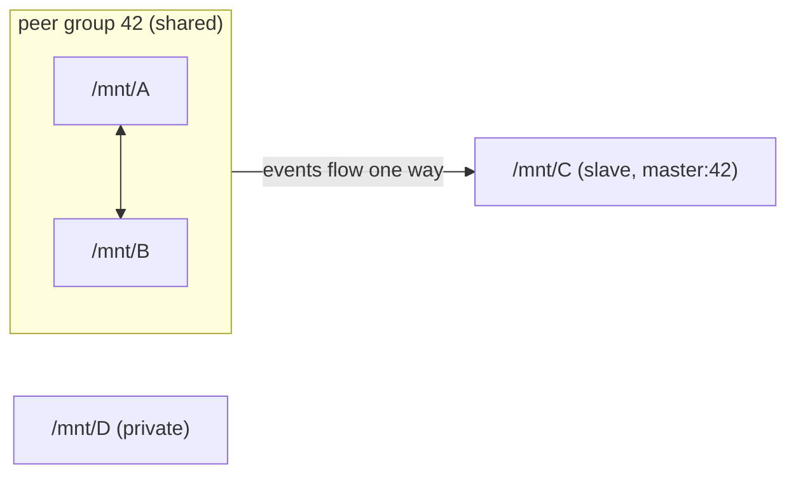

# 4. Mount Propagation

## The problem: copies of a mount tree drift apart

[Section 3](03-bind-mounts.md) showed that one directory can be visible at
several places. Now suppose a new filesystem is mounted *inside* one of those
places, for example a USB drive at `/data/usb`. Should it also appear at the
bind mount's other location? Sometimes yes (the user expects to see the drive
everywhere), sometimes no (an isolated environment should not receive it).

The problem becomes much bigger with mount namespaces (Chapter 03), where an
entire copy of the mount tree exists for a container. Without a rule, a disk
mounted on the host after the container starts would never be visible inside
the container, and a mount made inside a container could either be trapped
inside it or leak out onto the host.

Linux answers this with **shared subtrees**, better known as **mount
propagation**, added in Linux 2.6.15.

## The Linux abstraction: peer groups and propagation types

A **mount event** is a mount or unmount performed *below* a mount point, for
example mounting a tmpfs at `/data/usb` is an event on the mount that contains
`/data`.

Every mount has a **propagation type** that says how it exchanges mount events
with other mounts:

| Type | Sends events to others | Receives events from others | `mountinfo` field 7 |
|---|---|---|---|
| **shared** | yes, to its peers | yes, from its peers | `shared:N` |
| **slave** | no | yes, from its master peer group | `master:N` |
| **shared and slave** | yes, to its own peers | yes, from its master | `shared:M master:N` |
| **private** | no | no | *(empty)* |
| **unbindable** | no | no, and it cannot be bind-mounted | `unbindable` |

A **peer group** is a set of shared mounts that propagate events to each
other. `N` in `shared:N` is the peer group ID. Mounts become peers when:

- a **shared** mount is **bind-mounted**: the new mount joins the source's peer
  group;
- a **mount namespace is created** (Chapter 03): each shared mount in the new
  copy becomes a peer of the original.

A **slave** mount has a *master*: the peer group it was a member of when it was
made a slave. It keeps receiving events from that group but sends nothing back.



In this picture:

- a mount made under `/mnt/A/x` appears at `/mnt/B/x` and `/mnt/C/x`;
- a mount made under `/mnt/B/y` appears at `/mnt/A/y` and `/mnt/C/y`;
- a mount made under `/mnt/C/z` appears nowhere else;
- `/mnt/D` neither sends nor receives anything.

## Changing propagation

```bash
mount --make-shared     /mnt/A     # MS_SHARED
mount --make-slave      /mnt/C     # MS_SLAVE
mount --make-private    /mnt/D     # MS_PRIVATE
mount --make-unbindable /mnt/E     # MS_UNBINDABLE
mount --make-rslave     /          # the r- variants add MS_REC: apply to every mount below
```

```c
mount(NULL, "/", NULL, MS_SLAVE | MS_REC, NULL);   // what "--make-rslave /" does
```

Propagation flags cannot be combined with other operations in the same
`mount()` call. They change only the propagation type of existing mounts.

### Defaults you must know

1. **The kernel's default is private.** A new mount is private, *unless its
   parent mount is shared*, in which case it is also shared (in a new peer
   group of its own).
2. **systemd changes the default for the whole system.** At boot, systemd
   marks `/` and everything below it as **shared** (`MS_SHARED | MS_REC`),
   because desktop and service use cases expect mounts to appear in all
   namespaces. On most modern distributions, `findmnt -o TARGET,PROPAGATION`
   shows `shared` almost everywhere.

The combination means that on a typical host, new mounts are shared, and a
naive copy of the mount tree would stay connected to the host in **both**
directions. That is why container runtimes always set propagation explicitly.

## Why this matters for containers

When a runtime creates a mount namespace for a container, the copied mounts are
peers of the host mounts (because systemd made them shared). The runtime then
decides the direction of events:

| Goal | Propagation in the container | Effect |
|---|---|---|
| Full isolation | `rprivate` | no events in either direction |
| Receive host mounts, never leak | `rslave` | host → container only |
| Share both ways | `rshared` | host ↔ container; a container can create mounts visible on the host |

runc, by default, makes the container's whole mount tree **`rslave`** right
after creating the mount namespace, so mount events inside the container can
never reach the host. The OCI configuration field `rootfsPropagation` can
override this (Chapter 10).

Higher-level tools expose the same three choices per volume:

| Docker bind option | Kubernetes `mountPropagation` | Kernel type |
|---|---|---|
| `rprivate` (default) | `None` (default) | private |
| `rslave` | `HostToContainer` | slave |
| `rshared` | `Bidirectional` (requires a privileged container) | shared |

`Bidirectional` is used by storage drivers (CSI node plugins) that mount volumes
from inside a container so the host and other containers can see them. It
requires privilege because a container that can place mounts on the host can
hide or replace host files.

A common failure mode also becomes explainable: if a host path is mounted into
a container with private propagation, and the host later mounts a device below
that path, the container never sees the new mount.

## A practical checklist for reading `mountinfo`

When a mount "does not appear" or "appears in the wrong place", look at field 7
of the relevant mounts:

1. Is the parent mount of the event `shared:N`? If not, it sends nothing.
2. Which other mounts share `N` (peers), or show `master:N` (slaves)?
3. Is the receiving mount `private` or `unbindable`? Then it receives nothing.

## Evidence

Lab: [`lab-04-mount-propagation`](../../labs/02-linux-filesystem/lab-04-mount-propagation/)

The lab demonstrates propagation between bind mounts in a single mount
namespace. Chapter 03 repeats it across namespaces, where it matters most.

## Further Reading

- Kernel docs: [Shared Subtrees](https://docs.kernel.org/filesystems/sharedsubtree.html)
  — the original design document by Ram Pai, with the full state-transition
  rules and worked examples. Read sections 1–3 now; the rest is useful when
  debugging.
- [`mount_namespaces(7)`](https://man7.org/linux/man-pages/man7/mount_namespaces.7.html),
  section "Shared subtrees" — the clearest reference for defaults, peer groups,
  and `mountinfo` tags. It also explains the systemd default.
- LWN, Michael Kerrisk,
  ["Mount namespaces and shared subtrees"](https://lwn.net/Articles/689856/) and
  ["Mount namespaces, mount propagation, and unbindable mounts"](https://lwn.net/Articles/690679/)
  (2016) — step-by-step shell experiments; an excellent complement to this
  section and to Chapter 03.
- Kubernetes documentation:
  [Volumes — Mount propagation](https://kubernetes.io/docs/concepts/storage/volumes/#mount-propagation)
  — shows how the three kernel types surface in a real orchestrator, and why
  `Bidirectional` is restricted.
